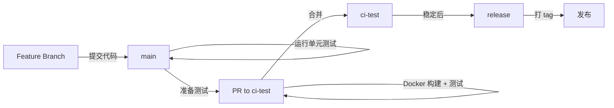

# 贡献指南

感谢你对 HookCode 项目的关注！我们欢迎任何形式的贡献。

[English Version](./CONTRIBUTING.md)

## 分支策略

HookCode 采用三分支开发模型：

### 分支说明

- **`main`** - 主开发分支
  - 日常开发工作在此分支进行
  - 提交代码时会自动运行单元测试
  - **不会**执行 Docker 构建
  - 保持代码随时可运行

- **`ci-test`** - CI 测试分支
  - 用于验证 Docker 构建和集成
  - 提交 PR 到此分支时会触发完整的 CI 流程（测试 + Docker 构建）
  - 确保 Docker 镜像可以正常构建

- **`release`** - 发布分支
  - 稳定的发布版本
  - **不执行** CI/CD
  - 仅用于标记和发布

### 工作流程



## 贡献流程

### 1. Fork 和克隆仓库

```bash
# Fork 项目到你的 GitHub 账号
# 然后克隆你的 fork
git clone https://github.com/YOUR_USERNAME/hookcode.git
cd hookcode
```

### 2. 创建功能分支

```bash
# 从 main 分支创建新的功能分支
git checkout main
git pull origin main
git checkout -b feature/your-feature-name
```

### 3. 开发和测试

```bash
# 安装依赖
corepack enable
pnpm install

# 运行开发环境
pnpm dev

# 运行测试
pnpm --filter hookcode-backend test
pnpm --filter hookcode-frontend test
```

### 4. 提交代码

遵循 [Conventional Commits](https://www.conventionalcommits.org/) 规范：

```bash
git add .
git commit -m "feat: add new webhook handler"
# 或
git commit -m "fix: resolve task queue deadlock"
```

**提交类型：**
- `feat`: 新功能
- `fix`: 修复 bug
- `docs`: 文档更新
- `style`: 代码格式调整（不影响功能）
- `refactor`: 代码重构
- `test`: 测试相关
- `chore`: 构建/工具配置

### 5. 推送到你的 Fork

```bash
git push origin feature/your-feature-name
```

### 6. 创建 Pull Request

#### 提交到 main（日常开发）

如果是常规的功能开发或 bug 修复：

1. 在 GitHub 上创建 PR，目标分支选择 `main`
2. 填写 PR 描述，说明你的改动
3. 等待 CI 运行单元测试
4. 代码审查通过后合并

#### 提交到 ci-test（Docker 构建验证）

如果你的改动涉及 Dockerfile、docker-compose 或需要验证容器构建：

1. 在 GitHub 上创建 PR，目标分支选择 `ci-test`
2. 填写 PR 描述，说明 Docker 相关的改动
3. 等待完整 CI 流程（测试 + Docker 构建）
4. 验证通过后合并

## 代码规范

### 注释要求

**目标：** 让代码库像百科全书一样——代码和注释同步演进，每次变更都保持清晰、可追溯、易于理解。

#### 强制规则

1. **行内注释** - 在代码实际位置编写注释（不要创建单独的 `.md` 文档替代代码注释）
2. **同步更新** - 每次代码变更（新增/修改/重构/修复）后，必须同步添加或更新对应的行内注释
3. **复杂度匹配** - 注释必须与代码复杂度相匹配（简单 vs 中等 vs 复杂）
4. **Swagger 文档** - 后端 Swagger 相关文档必须遵循 OpenAPI/Swagger 注释格式
5. **英文注释** - 所有代码注释和控制台输出必须使用英文

#### 按复杂度编写注释

**简单逻辑**（直观、自解释）：
- 仅在需要澄清业务含义、非显而易见的意图或重要约束时添加简短注释
- 最低要求：业务意图 + 使用说明（如需要）

**中等复杂度**（多分支、非平凡验证、集成）：
- 说明：实现什么业务、属于哪个业务模块/子部分、关键步骤、重要边界情况
- 添加：陷阱/假设（如：顺序、重试、幂等性、时区、分页）

**复杂逻辑**（状态机、并发、分布式工作流、关键性能/安全）：
- 在代码附近提供结构化的行内注释集：
  - 业务上下文：模块 + 子部分 + 目的
  - 关键工作流步骤：先做什么/接下来/最后以及原因
  - 不变量/约束：必须始终为真的条件
  - 失败模式：可能出错的情况、如何处理、故意不处理的情况
  - 安全说明：安全性、权限边界、数据敏感性、速率限制
  - 性能说明：大 O 或瓶颈、缓存、批处理
  - 陷阱：已知的棘手行为、易错点、竞态条件
  - TODO/未实现：清楚标记缺失部分和未来工作

#### 必需内容检查清单（视情况而定）

- 实现的业务行为（做什么）
- 属于哪个业务模块和哪个部分
- 关键步骤和主要逻辑说明
- 变更记录（改了什么以及为什么）—— 保持在变更位置附近
- 使用方式（如何/在哪使用）
- 重要说明/注意事项/假设
- 未实现部分 / TODO
- 潜在陷阱和如何避免

### 工具函数复用

- 避免跨文件复制粘贴工具函数
- 添加辅助函数（环境解析、查询解析等）前，先搜索仓库并复用现有实现
- 否则提取到共享模块（如 `backend/src/utils/*`, `frontend/src/utils/*`）并添加单元测试

### 测试要求

- 新功能必须包含测试
- 运行测试确保没有破坏现有功能：
  ```bash
  pnpm --filter hookcode-backend test
  pnpm --filter hookcode-frontend test
  ```

## 环境配置

### 后端环境变量

在 `backend/.env.development` 添加新配置时，需要：

1. 在对应的 `.env.*.example` 文件中添加条目
2. 为每个条目添加中文注释说明用途

示例：

```bash
# Webhook 接收地址
WEBHOOK_URL=http://localhost:3000/webhook

# GitLab API 访问令牌
GITLAB_ACCESS_TOKEN=your-token-here
```

## 开发建议

- **避免过度思考**：优先考虑高质量、实用的代码改动
- **不要破坏现有改动**：不要回退或删除你在本次对话中未做的改动
- **前后端联动**：修改后端代码时，检查前端是否也需要更新
- **数据库兼容性**：系统仍在积极开发中，数据很少/无数据；不需要考虑旧数据的向后兼容性。如果 DB schema 有问题，可以直接删除并重建

## 需要帮助？

- 查看 [README.md](./README-zh-CN.md) 了解项目概况
- 查看 [AGENTS.md](./AGENTS.md) 了解 AI 开发要求
- 提交 Issue 描述问题或建议
- 在 PR 中 @维护者 寻求帮助

## 行为准则

- 尊重所有贡献者
- 专注于技术讨论
- 遵循项目代码规范
- 保持友善和专业

---

再次感谢你的贡献！🎉
