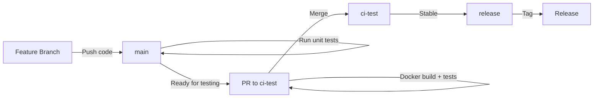

# Contributing Guide

Thank you for your interest in contributing to HookCode! We welcome contributions of all kinds.

[中文版本](./CONTRIBUTING-zh-CN.md)

## Branch Strategy

HookCode uses a three-branch development model:

### Branch Overview

- **`main`** - Main development branch
  - Daily development work happens here
  - Automatic unit tests run on code commits
  - Docker builds are **not** executed
  - Code should always be runnable

- **`ci-test`** - CI testing branch
  - Used for validating Docker builds and integration
  - PRs to this branch trigger full CI pipeline (tests + Docker build)
  - Ensures Docker images build correctly

- **`release`** - Release branch
  - Stable release versions
  - **No CI/CD** execution
  - Used only for tagging and releases

### Workflow



## Contribution Process

### 1. Fork and Clone

```bash
# Fork the project to your GitHub account
# Then clone your fork
git clone https://github.com/YOUR_USERNAME/hookcode.git
cd hookcode
```

### 2. Create Feature Branch

```bash
# Create a new feature branch from main
git checkout main
git pull origin main
git checkout -b feature/your-feature-name
```

### 3. Develop and Test

```bash
# Install dependencies
corepack enable
pnpm install

# Run development environment
pnpm dev

# Run tests
pnpm --filter hookcode-backend test
pnpm --filter hookcode-frontend test
```

### 4. Commit Changes

Follow [Conventional Commits](https://www.conventionalcommits.org/) specification:

```bash
git add .
git commit -m "feat: add new webhook handler"
# or
git commit -m "fix: resolve task queue deadlock"
```

**Commit Types:**
- `feat`: New feature
- `fix`: Bug fix
- `docs`: Documentation update
- `style`: Code formatting (no functional changes)
- `refactor`: Code refactoring
- `test`: Test-related changes
- `chore`: Build/tooling configuration

### 5. Push to Your Fork

```bash
git push origin feature/your-feature-name
```

### 6. Create Pull Request

#### Submit to main (Regular Development)

For routine feature development or bug fixes:

1. Create a PR on GitHub targeting the `main` branch
2. Fill in the PR description explaining your changes
3. Wait for CI to run unit tests
4. Merge after code review approval

#### Submit to ci-test (Docker Build Validation)

If your changes involve Dockerfile, docker-compose, or require container build validation:

1. Create a PR on GitHub targeting the `ci-test` branch
2. Fill in the PR description explaining Docker-related changes
3. Wait for full CI pipeline (tests + Docker build)
4. Merge after validation passes

## Code Standards

### Comment Requirements

**Goal:** Maintain the codebase like an encyclopedia — code and comments evolve together, and every change stays clear, traceable, and easy to understand.

#### Mandatory Rules

1. **Inline Comments** - Write comments at the actual code location (do NOT create separate `.md` documentation as a substitute)
2. **Synchronous Updates** - After EVERY code change (add/modify/refactor/fix), you MUST add or update corresponding inline comments
3. **Complexity Matching** - Comments must match code complexity level (simple vs medium vs complex)
4. **Swagger Documentation** - Backend Swagger-related documentation MUST follow OpenAPI/Swagger annotation format
5. **English Comments** - All code comments and console output MUST be in English

#### Comments by Complexity

**Simple Logic** (straightforward, self-explanatory):
- Add short comments only when clarifying business meaning, non-obvious intent, or important constraints
- Minimum: business intent + usage note (if needed)

**Medium Complexity** (multiple branches, non-trivial validation, integrations):
- Explain: business implementation, which business module/sub-part, key steps, important edge cases
- Add: pitfalls/assumptions (e.g., ordering, retries, idempotency, timezones, pagination)

**Complex Logic** (state machines, concurrency, distributed workflows, critical performance/security):
- Provide structured inline comments near the code:
  - Business context: module + sub-part + purpose
  - Key workflow steps: what happens first/next/last and why
  - Invariants/constraints: what must always hold true
  - Failure modes: what can go wrong, how it's handled, what's intentionally NOT handled
  - Safety notes: security, permission boundaries, data sensitivity, rate limits
  - Performance notes: big-O or bottlenecks, caching, batching
  - Pitfalls: known tricky behaviors, footguns, race conditions
  - TODO/Not implemented: clearly mark missing parts and future work

#### Required Content Checklist (as applicable)

- Business behavior implemented (what it does)
- Which business module and part it belongs to
- Key steps and main logic explanation
- Change record (what changed and why) — keep close to change site
- Usage (how/where it's used)
- Important notes/caveats/assumptions
- Unimplemented parts / TODOs
- Potential pitfalls and how to avoid them

### Utility Function Reuse

- Avoid copy-pasting utilities across files
- Before adding a helper (env parsing, query parsing, etc.), search the repo and reuse existing implementation
- Otherwise, extract it into a shared module (e.g., `backend/src/utils/*`, `frontend/src/utils/*`) and add unit tests

### Testing Requirements

- New features must include tests
- Run tests to ensure no existing functionality is broken:
  ```bash
  pnpm --filter hookcode-backend test
  pnpm --filter hookcode-frontend test
  ```

## Environment Configuration

### Backend Environment Variables

When adding new configuration to `backend/.env.development`:

1. Add entry to corresponding `.env.*.example` file
2. Add Chinese comment for each entry explaining its purpose

Example:

```bash
# Webhook 接收地址
WEBHOOK_URL=http://localhost:3000/webhook

# GitLab API 访问令牌
GITLAB_ACCESS_TOKEN=your-token-here
```

## Development Guidelines

- **Avoid overthinking**: Prioritize high-quality, practical code changes
- **Don't break existing changes**: Do not revert or delete changes you didn't make in this conversation
- **Frontend-Backend coordination**: When changing backend code, check if frontend also needs updates
- **Database compatibility**: System is still in active development with little/no data; backward compatibility for old data is not required. If DB schema is wrong, it's acceptable to delete and recreate

## Need Help?

- Check [README.md](./README.md) for project overview
- Check [AGENTS.md](./AGENTS.md) for AI development requirements
- Submit an Issue describing problems or suggestions
- @mention maintainers in PR for assistance

## Code of Conduct

- Respect all contributors
- Focus on technical discussions
- Follow project code standards
- Be friendly and professional

---

Thank you again for your contribution! 🎉
