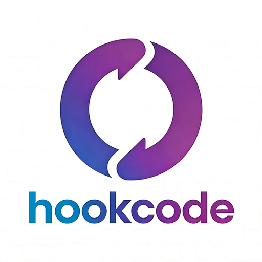
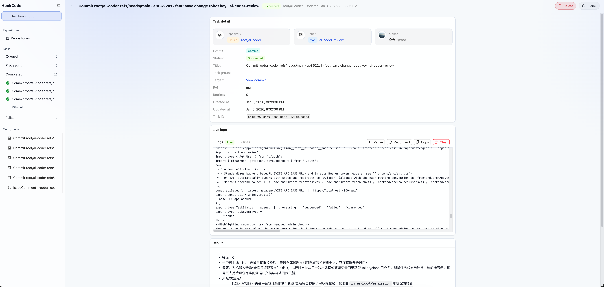

<div align="center">

<picture>
  <source media="(prefers-color-scheme: dark)" srcset="logo/logo-dark-text-512.png">
  
</picture>

# HookCode

[English](README.md) | [简体中文](README-zh-CN.md)

</div>

<br/>

## 简介

HookCode 是一个通过对话和 Webhook 优雅触发 CLI 编码助手的智能代码审查与自动化平台。支持独立部署，提供可视化控制台实时查看任务执行状态。

### 支持的 CLI 编码助手
- **Claude Code** - Anthropic 的代码助手
- **Codex** - OpenAi 的代码助手
- **Gemini** - Google 的代码助手

### 支持的代码仓库
- **GitHub** - 完整的 Webhook 与 API 集成
- **GitLab** - 完整的 Webhook 与 API 集成

## 使用场景

- 在 commit 提交代码之后使用自己配置的 cli 编码助手 review 代码提交的质量
- 提交构建需求之后，会执行构建任务，修复 bug / 实现功能，然后提交 pr 到仓库中
- 提交 issue 之后，使用自己配置的 cli 编码助手回复用户提出的问题或者直接提交代码
- 代码仓库中合并代码之后，可以在使用自己配置的 cli 编码助手判断合并的质量
- 多助手执行，gemini 生成设计方案， claude code 确认执行方案， codex 执行构建

## 界面预览

<div align="center">

### 任务详情视图


*实时任务执行监控，展示详细日志和分析结果*

</div>

# 快速开始

## Docker 部署（推荐）

**推荐使用 Docker Compose 一键启动所有服务（数据库 + 后端 + 前端）**

Docker 部署相关资源集中在 `docker/` 目录下：
- Compose 文件：`docker/docker-compose.yml`
- Nginx 反向代理配置：`docker/nginx/frontend.conf`
- 单一 env 文件（前端构建 + 后端运行共用）：`docker/.env`

1. 配置环境变量：复制 `docker/.env.example` 为 `docker/.env`，根据需要修改配置（至少修改 `AUTH_TOKEN_SECRET` 和管理员账号密码）
2. 构建并启动服务：
   ```bash
   docker compose -f docker/docker-compose.yml up -d --build
   ```
3. 访问前端控制台：`http://localhost`（或 `http://localhost:<HOOKCODE_FRONTEND_PORT>`）
   - 默认管理员账号见 `docker/.env` 的 `AUTH_ADMIN_USERNAME/AUTH_ADMIN_PASSWORD`（示例为 `admin/admin`，生产环境务必修改）
   - 登录后默认进入：
     - 普通用户：`#/account`
     - 管理员：`#/admin/users`
     - 任务列表：`#/tasks`

**自定义配置：**
- **端口配置**：在 `docker/.env` 中修改 `HOOKCODE_FRONTEND_PORT/HOOKCODE_BACKEND_PORT/HOOKCODE_DB_PORT`
- **数据库账号**：在 `docker/.env` 中修改 `DB_USER/DB_PASSWORD/DB_NAME`
- **Cloudflare（单端口）**：
  - 在 `docker/.env` 中保持 `VITE_API_BASE_URL=/api`
  - 通过 `https://<你的域名>/api/...` 访问后端（不要再用 `:8000`）
- **CI/CD**：在 GitHub Actions 或 GitLab CI 中请使用 secrets 或 variables 管理敏感信息

**技术说明：**
- backend/frontend 均有独立 Dockerfile
- Docker Compose 通过 `env_file` 注入 `docker/.env`（不提交到版本控制）

## 本地开发

如需进行源码开发或调试，可以使用以下方式：

1. 安装依赖（推荐启用 corepack 以使用 pnpm）
   ```bash
   corepack enable
   pnpm install
   ```
2. 一键启动（数据库 + 后端 + 前端）
   ```bash
   pnpm dev
   ```
   - 控制台已启用登录：默认账号见 `backend/.env.example` 的 `AUTH_ADMIN_USERNAME/AUTH_ADMIN_PASSWORD`（示例为 `admin/admin`，生产务必修改并设置 `AUTH_TOKEN_SECRET`）
   - 如需邮箱自助注册：后端配置 `AUTH_REGISTER_ENABLED=true`（示例文件已开启），并配置邮件服务（例如 `EMAIL_PROVIDER=smtp` + `SMTP_*`）与 `HOOKCODE_CONSOLE_BASE_URL`；注册后会发送验证邮件，点击链接完成验证后即可登录
   - 登录后默认进入：
     - 普通用户：`#/account`
     - 管理员：`#/admin/users`
     - 任务列表：`#/tasks`
   
3. **分模块开发：**
   - 仅启动数据库：
     ```bash
     pnpm dev:db
     ```
   - 仅后端开发（默认 4000 端口）：
     ```bash
     pnpm dev:backend
     ```
   - 仅前端开发（默认 5173 端口）：
     ```bash
     pnpm dev:frontend
     ```

4. **使用远程数据库**：复制 `backend/.env.example` 为 `backend/.env`，保持本地前后端端口不变，并将数据库指向你的远程 Postgres（设置 `DB_HOST`、`DB_PORT` 等，或直接设置 `DATABASE_URL`）

## 环境变量

- **后端**：`backend/.env.example`。复制为 `backend/.env` 用于本地开发或部署（勿提交真实密钥）。开发环境若使用远程 DB，可覆盖 `DB_HOST/DB_PORT/DB_USER/DB_PASSWORD/DB_NAME`（或直接设置 `DATABASE_URL`）
- **前端**：`frontend/.env.example`（Vite 的 `VITE_*` 变量在构建时注入；设置 `VITE_API_BASE_URL` 为后端 API Base，例如 `http://localhost:4000/api`）
- **仓库配置**：Robot/token 已支持通过控制台（数据库）管理；不再支持 env token 兜底，请在控制台按 Robot/账号/仓库维度配置 token


## License

MIT（见 `LICENSE`）。
