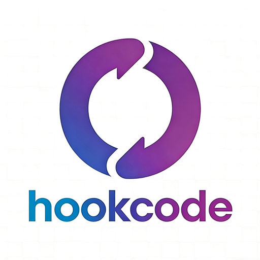
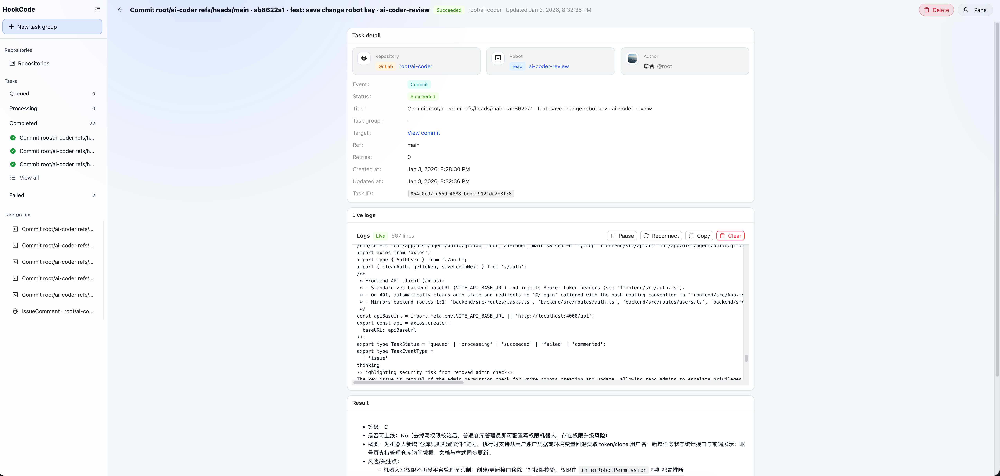

<div align="center">

<picture>
  <source media="(prefers-color-scheme: dark)" srcset="logo/logo-dark-text-512.png">
  
</picture>

# HookCode

[English](README.md) | [简体中文](README-zh-CN.md)

</div>

<br/>

## 简介

HookCode 是一个通过对话和 Webhook 优雅触发 CLI 编码助手的智能代码审查与自动化平台。支持独立部署，提供可视化控制台实时查看任务执行状态。

### 支持的 CLI 编码助手
- **Claude Code** - Anthropic 的代码助手
- **Codex** - OpenAi 的代码助手
- **Gemini** - Google 的代码助手

### 支持的代码仓库
- **GitHub** - 完整的 Webhook 与 API 集成
- **GitLab** - 完整的 Webhook 与 API 集成

## 使用场景

- 在 commit 提交代码之后使用自己配置的 cli 编码助手 review 代码提交的质量
- 提交构建需求之后，会执行构建任务，修复 bug / 实现功能，然后提交 pr 到仓库中
- 提交 issue 之后，使用自己配置的 cli 编码助手回复用户提出的问题或者直接提交代码
- 代码仓库中合并代码之后，可以在使用自己配置的 cli 编码助手判断合并的质量
- 多助手执行，gemini 生成设计方案， claude code 确认执行方案， codex 执行构建

## 界面预览

<div align="center">

### 任务详情视图


*实时任务执行监控，展示详细日志和分析结果*

</div>

# 快速开始

> 需要有一个公网可访问的服务器来接收仓库 Webhook。

<!-- Reorganize command-first quick start workflows for Docker and local development clarity. docs/en/developer/plans/readmecmd20260227/task_plan.md readmecmd20260227 -->
## Docker 部署（推荐）

使用 Docker Compose 一次启动 **数据库 + backend + worker + frontend**。

<!-- Document Docker work-root and named-volume behavior so deployment docs stay aligned with HOOKCODE_WORK_DIR. docs/en/developer/plans/worker-executor-refactor-20260307/task_plan.md worker-executor-refactor-20260307 -->

### 1）准备环境变量文件

```bash
cp docker/.env.example docker/.env
```

生产环境至少修改 `docker/.env` 中以下字段：
- `AUTH_TOKEN_SECRET`
- `AUTH_ADMIN_USERNAME`
- `AUTH_ADMIN_PASSWORD`
- 如需修改容器内工作根目录，再调整 `HOOKCODE_WORK_DIR`（必须保持绝对路径，例如 `/var/lib/hookcode`）
- 如不想继续使用示例 Docker worker 绑定码，请修改 `HOOKCODE_SYSTEM_WORKER_BIND_CODE`

### 2）构建并启动全部服务

```bash
docker compose -f docker/docker-compose.yml up -d --build
```

如果希望 backend 仅等待独立部署的远程 worker，请只启动 `db backend frontend`，不要带上同 Compose 的 `worker` 服务。

### 3）查看运行状态和日志

```bash
docker compose -f docker/docker-compose.yml ps
```

```bash
docker compose -f docker/docker-compose.yml logs -f backend worker frontend
```

### 4）日常运维命令

重启全部服务：

```bash
docker compose -f docker/docker-compose.yml restart
```

后端代码变更后，只重建并重启 backend/worker：

```bash
docker compose -f docker/docker-compose.yml up -d --build backend worker
```

前端代码变更后，只重建并重启 frontend：

```bash
docker compose -f docker/docker-compose.yml up -d --build frontend
```

停止并删除容器：

```bash
docker compose -f docker/docker-compose.yml down
```

停止并删除容器 + 数据库/工作目录卷：

```bash
docker compose -f docker/docker-compose.yml down -v
```

### 5）访问地址和默认信息

- 前端控制台：`http://localhost`（或 `http://localhost:<HOOKCODE_FRONTEND_PORT>`）
- 后端 API：`http://localhost:<HOOKCODE_BACKEND_PORT>`
- 默认管理员账号密码来自 `docker/.env` 的 `AUTH_ADMIN_USERNAME` / `AUTH_ADMIN_PASSWORD`

### 6）Docker 模式的重要行为说明

- frontend/backend 在容器内运行的是构建产物。
- **宿主机源码变更不会自动热更新到容器。**
- 代码变更后请执行对应的 `up -d --build ...` 重建命令。

### Docker 配置说明

- Docker 相关资源在 `docker/` 目录：
  - 主栈 Compose 文件：`docker/docker-compose.yml`
  - Nginx 反向代理配置：`docker/nginx/frontend.conf`
  - 主栈环境变量文件：`docker/.env`
- 端口覆盖：`HOOKCODE_FRONTEND_PORT`、`HOOKCODE_BACKEND_PORT`、`HOOKCODE_DB_PORT`
- 数据库凭据：`DB_USER`、`DB_PASSWORD`、`DB_NAME`
- 运行时存储：`HOOKCODE_WORK_DIR`（Docker Compose 会把 backend/worker 各自的命名卷挂到这个容器内绝对路径）
- 默认 Docker worker 模式：backend 以 `HOOKCODE_SYSTEM_WORKER_MODE=external` 启动，可选的同 Compose `worker` 服务会在首次启动时消费同一个 `HOOKCODE_SYSTEM_WORKER_BIND_CODE`，随后从 `HOOKCODE_WORK_DIR` 中持久化的凭据继续启动
- Cloudflare 单端口路由：
  - 保持 `VITE_API_BASE_URL=/api`
  - 通过 `https://<你的域名>/api/...` 访问 API（不要用 `:8000`）

## 本地开发

如果需要源码级调试和热更新，使用本地开发命令。

### 1）安装依赖

```bash
corepack enable
pnpm install
```

### 2）一键启动

```bash
pnpm dev
```

### 3）按模块启动（可选）

仅启动数据库：

```bash
pnpm dev:db
```

仅启动后端（默认 `4000`）：

```bash
pnpm dev:backend
```

仅启动前端（默认 `5173`）：

```bash
pnpm dev:frontend
```

### 4）本地开发接远程数据库（可选）

复制 `backend/.env.example` 为 `backend/.env`，保持本地前后端端口不变，然后将数据库配置指向远程 Postgres（`DB_HOST`、`DB_PORT`、`DB_USER`、`DB_PASSWORD`、`DB_NAME`，或直接设置 `DATABASE_URL`）。

### 5）登录与注册说明

- 默认启用登录。
- 默认管理员账号见 `backend/.env.example`（`AUTH_ADMIN_USERNAME` / `AUTH_ADMIN_PASSWORD`）。
- 生产环境请设置强随机的 `AUTH_TOKEN_SECRET`。
- 若启用邮箱自助注册，需要配置后端邮件相关参数（`AUTH_REGISTER_ENABLED`、`EMAIL_PROVIDER`、`SMTP_*`、`HOOKCODE_CONSOLE_BASE_URL`）。


## 环境变量

- **后端**：`backend/.env.example`。复制为 `backend/.env` 用于本地开发或部署（勿提交真实密钥）。开发环境若使用远程 DB，可覆盖 `DB_HOST/DB_PORT/DB_USER/DB_PASSWORD/DB_NAME`（或直接设置 `DATABASE_URL`）
- **前端**：`frontend/.env.example`（Vite 的 `VITE_*` 变量在构建时注入；设置 `VITE_API_BASE_URL` 为后端 API Base，例如 `http://localhost:4000/api`）
- **仓库配置**：Robot/token 已支持通过控制台（数据库）管理；不再支持 env token 兜底，请在控制台按 Robot/账号/仓库维度配置 token


## License

MIT（见 `LICENSE`）。
